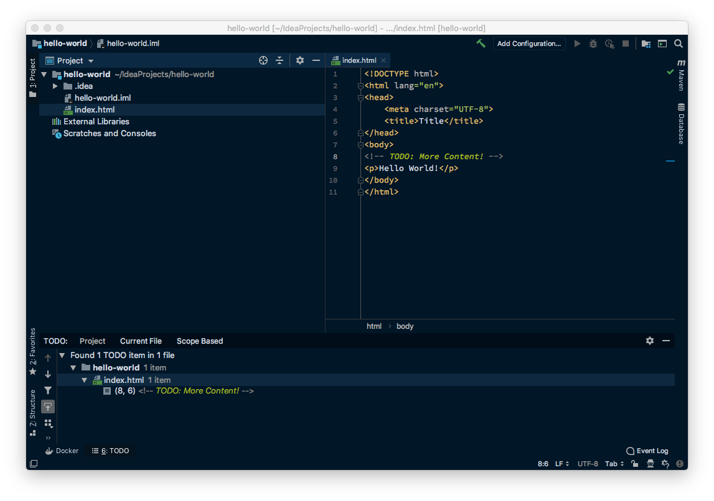
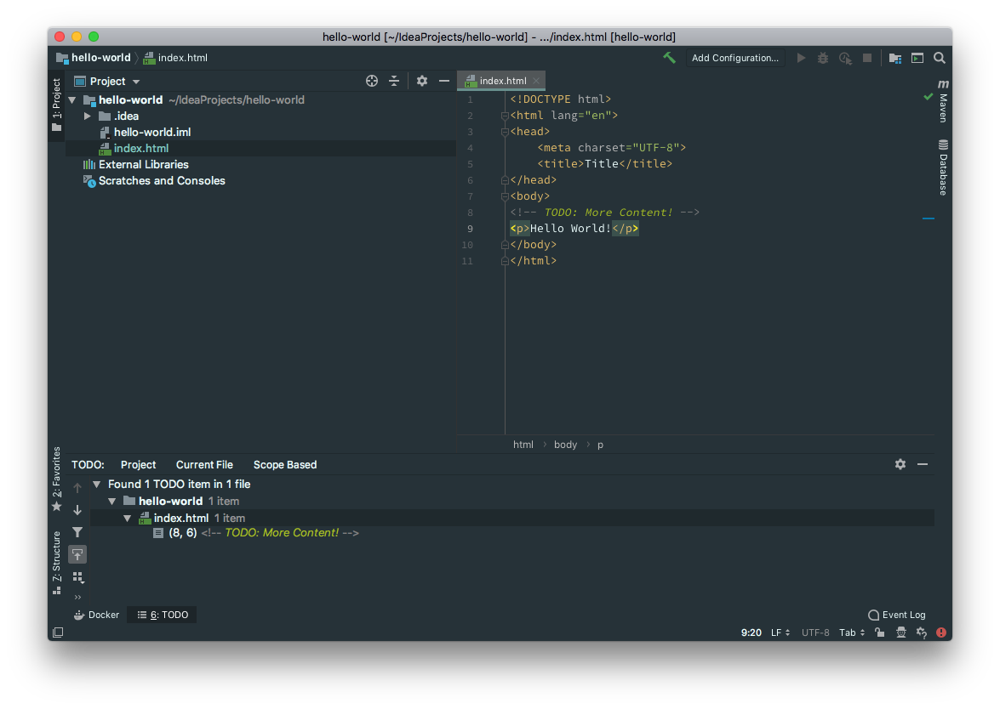
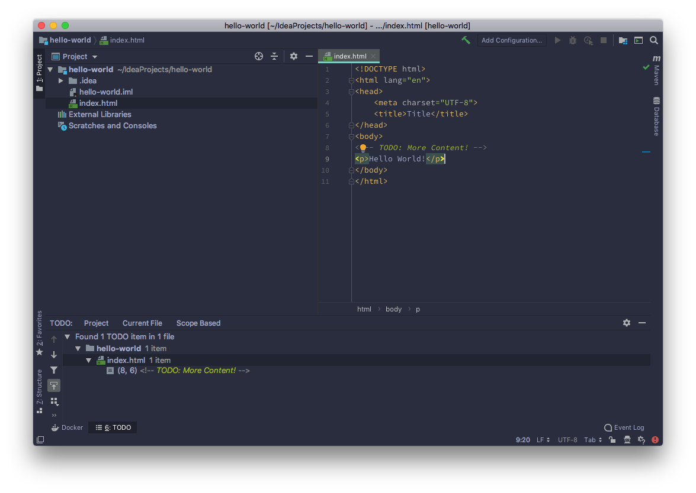
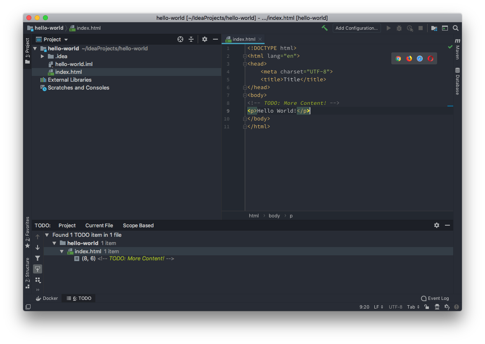
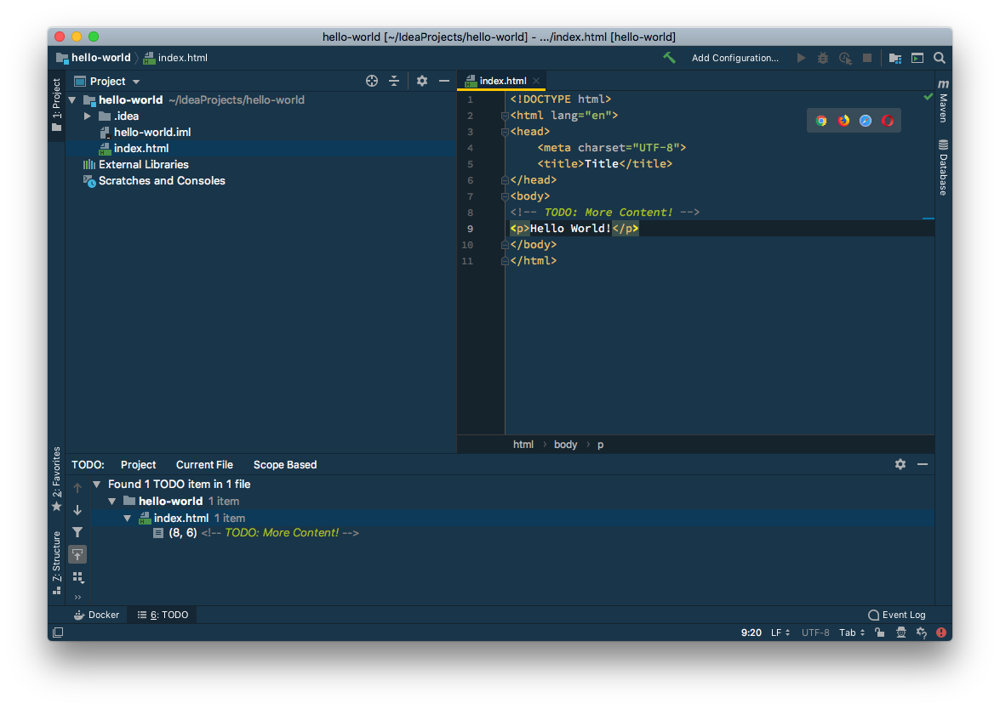
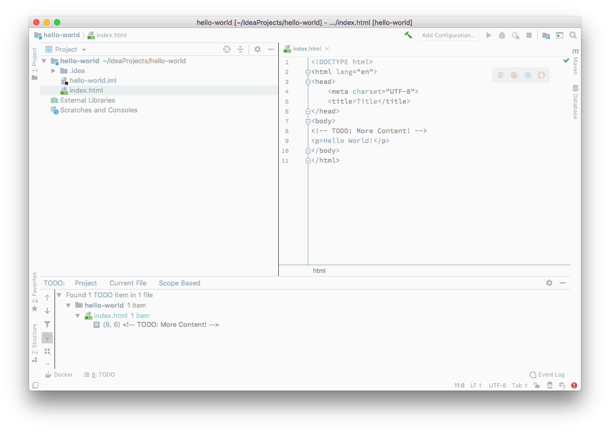

# 🎨 Themes for JetBrains (IntelliJ, WebStorm, CLion, ...)

At the moment, we only use some of the color properties of the original theme. This will be fixed in future versions!

## 🌌 Dark Themes
### Night Owl
#### Download

### Material Theme: Default

### Material Theme: Night

### Material Theme: Ocean

### Sublime

### Cobalt

## ☀️ Light Themes
### Material Theme: Lighter
#### Screenshot

## Credits
The color properties were used from the following themes for Visual Studio Code. Thank you very much!

|Repository|License|
|---|---|
|https://github.com/sdras/night-owl-vscode-theme|MIT|
|https://github.com/equinusocio/vsc-material-theme|Apache 2.0|
|https://github.com/gaearon/subliminal|MIT|
|https://github.com/wesbos/cobalt2-vscode|MIT|

